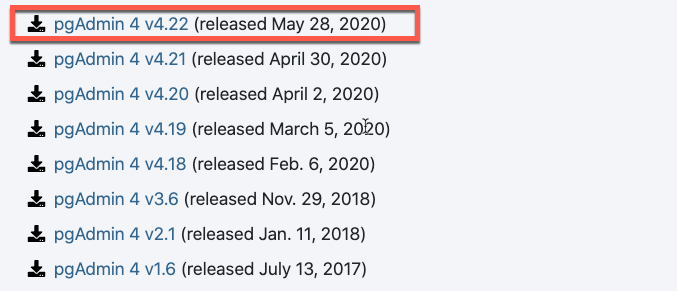
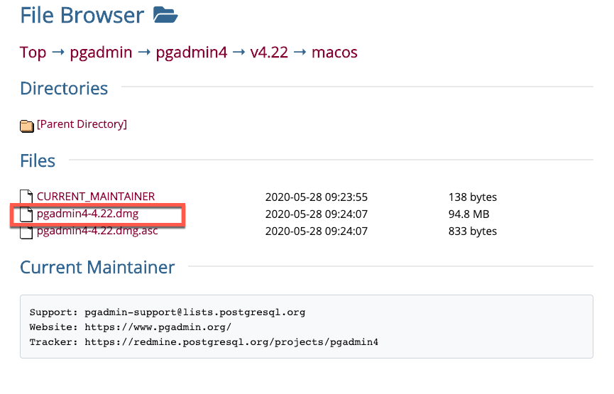
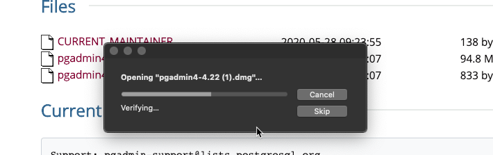
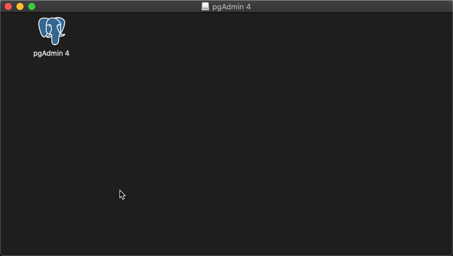

# Installing pgAdmin and Postgres on a Mac

Similar to coding with Python using Visual Studio Code, SQL requires a code editor with the ability to execute the scripts developers (you!) create.

The first thing we're going to install is Postgres. There are two main routes we can take in order to install Postgres onto your machine:

* Using a graphical user interface (GUI).

* Using a package manager via the command line (CLI).

For this installation we are going to use the CLI. 

## Before you Begin

* Make sure you have a package manager called [Homebrew](https://brew.sh/) installed.

* In case installation is needed, follow the installation process below:

  * Open terminal.

  * Copy and paste the following command:

  ```
  ruby -e "$(curl -fsSL https://raw.githubusercontent.com/Homebrew/install/master/install)"
  ```

## Installing Postgres

* Once Homebrew has been installed run the following command to install postgreSQL:

  ```
  brew install postgresql
  ```

* To check the version of Postgres installed run the following command:

  ```
  postgres --version
  ```

## Start Postgres

* The next step in the process is to start Postgres running the following command:

  ```
  brew services start postgres
  ```
  
  * A few points to be aware of:
  
    1. An error message will be raised if you don't run the `brew services start postgres` command.

    2. It is recommended that you leave it on, otherwise you will need to run it every time.
  
    3. There is a command to stop Postgres running as well as restart it in case you need it.

    * To stop Postgres run the following command:

    ```
    brew services stop postgres
    ```

    * To restart Postgres run the following command:

    ```
    brew services restart postgres
    ```

## Login to Postgres database

* By default Postgres has a database named **postgres**. In order to connect to the database run the following command:

  ```
  psql postgres
  ```

  * Once connected the following output will show.

  ```psql (12.3)
     Type "help" for help.

     postgres=#
  ```

## Default postgres username for pgAdmin

* In order to connect and log in to pgAdmin, you must create a user with the username 'postgres' along with a password.

  * To create an username with a password at the **same time** run the following command:

  ```
  postgres=#create user postgres with login password <create your own passsword here>;
  ```

  * To list all users run the `du` command.

  ```
  postgres=# \du
                                   List of roles

  Role name |                         Attributes                         | Member of
  ----------+------------------------------------------------------------+-----------
  postgres  |                                                            | {}
  tal       | Superuser, Create role, Create DB, Replication, Bypass RLS | {}
  ```

## pgAdmin

* Now that you have finished installing Postgres, download and install pgAdmin. **Note**: Moving forward we are going to use the GUI.

* Instructions:

  * Visit this download link: [pgAdmin Versions](https://www.pgadmin.org/download/pgadmin-4-macos/)

  * Click on the latest version.

    

  * Click on `pgadmin4-4.22.dmg`

    

  * Once downloaded click the file to start installation.

    

  * Drag the pgAdmin logo to the application folder.

    

  * Go ahead and command + space. Type pgAdm... and enter! Open and login!! Happy SQLing!
