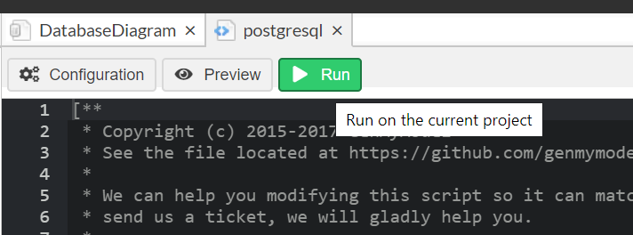

## Designing an ERD, Part II

In this activity, you and your partner will continue designing an entity relationship diagram for the gym by transitioning your logical ERD created in the previous activity to a physical ERD.

### Instructions

* Return to [GenMyModel](https://app.genmymodel.com/) and transition your logical ERD to a physical ERD by creating the relationships between tables.

* When you are satisfied with your ERD, export the diagram as a PostgreSQL file:

  * Click on the **Generators** tab and select **postgresql** from the heirarchy.

    

  * You can preview the SQL that will be generated by clicking the preview button.  When you click the run button your SQL will be generated, and when it is finished you'll be presented with a dialog box to download your archive. A zipped folder will appear in your Downloads folder that contains your SQL file.

    

* In pgAdmin, connect to your server and create a new database named `gym`. Then open a query tool.

* Paste the code from your schema file in pgAdmin, and then execute the code.
* Open the file you downloaded with VS Code. Paste the code in pgAdmin, and then execute the code.

### Hints

* You will need to add foreign keys to your tables in order to map the data relationships.

* Keep in mind the following: 

  * Each member belongs to only one gym.
  * Trainers work for only one gym, but a gym has many trainers.
  * Each member must have a trainer, but each trainer may instruct multiple members.

* Once the exported code has been used to create tables using pgAdmin, you can check the table creation with the following syntax:

  ```sql

  ```
