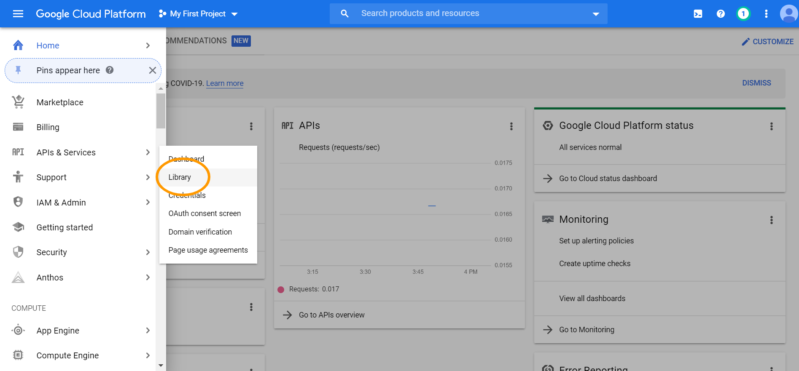

## Getting Started

The best place for getting started with google maps APIs is with their own getting started page. 

[https://developers.google.com/maps/gmp-get-started](https://developers.google.com/maps/gmp-get-started)

Please **read** the entire thing. 

No really. 

Go ahead. 

I'll wait. 

... 

Now that you've read through all four steps of the instructions, I'll take you through them below with annotated screenshots. 

Under step 1, you'll see a link to the [Google Cloud Platform Console](https://console.cloud.google.com/getting-started). You will need to sign in or create a google account. 

Agree to the terms of service and click the Agree and Continue button. 

You can dismiss or ignore the message at the top of the page about activating your free credit. Instead go to the Billing section of the menu on the left. 

Click on the blue Add billing account button in the middle of the page. You will once again have to agree to the terms of service and then click continue. 

In step two, you will input your customer info, including a complete address and credit or debit card info. I've heard services like Privacy.com are great if you want to have more control over who has you financial info. You can label yourself as either a business or an individual, up to you. Click the START MY FREE TRIAL button at the bottom of the page.

Google throws lots of stuff on the page when you first visit in an attempt to help you get oriented. You can just click the class project button in the list and click Next to answer their four marketing questions. Or, you can scroll down to the bottom and click Skip.

You may have noticed that the cloud console link opened in another tab. That means you still have access to the getting started page. Go back and pick up there at step two. The instructions say to click on the sandwich icon and select Home in the menu. The menu is likely already open in the cloud console, so just click on Home. 

Upon creating an account and setting up billing, google will have already created a project for you called My First Project. You are welcome to use this default or start a specific bootcamp project. The default project will already be associated with the billing account you created. You can set the billing account on a new project during the creation steps. **You must have a billing account associated with the project using the API key you create or your api queries will return errors.**

If you want to triple check, open up the sliding menu on the left, and in the IAM & Admin section click on Manage Resources. You'll see a list of your projects there. Select the one you are going to use. On the right there is an activity tab, and if you've got an AssignResourceToBillingAccount activity for that project, you can click on it and verify that there is a billing account associated wth your project. 

Head back over to the getting started tab and navigate down to step 3. Let's add some APIs to our project. In the left slider menu go to APIs & Services and select Library.

View all the Maps APIs by clicking on the View All link. You will need both the Geocoding API and Places API enabled for class activities. 

For each of the two APIs, make sure the project you want to use is selected in the dropdown menu in the blue bar on the top of the page before you click the enable button.

You will be deposited on the Metrics page for that API after you enable it. You'll see Credentials in the left menu. Ignore that. Click on the sandwich icon to open the sliding menu on the left and under APIs & Services click on Credentials. 

You should not have any API Keys yet. To generate an API key click on the +CREATE CREDENTIALS button near the top of the page and select API Key from the dropdown.

You will see your shiny new API key in the popup window that is displayed. You have the option of copying it now, but you will be able to access this credentials page and copy the API key for your code when you need it. For now, click the Restrict Key button in the popup window. 

There are two kinds of restrictions you can place on google API keys. You can restrict which kind of applications and where requests will be valid from. We will be using these keys in jupyter notebooks, which are served from localhost on our machines. So we can select HTTP referrers (web sites) from the radio button list, click Add An Item and input localhost in the box. I consider this one optional if I'm only using the API key locally. If I am deploying to a server with a registered domain name, though, I always set this restriction to the site the API is for.

You can also restrict which specific google APIs can be used with the key. In the API restrictions section of the page select the Restrict Key radio button, then search for the geocoding and places APIs and check the boxes next to them. One API Key can be configured to use several different services, so you should have these two selected for this one API key. Note the note that it may take 5 minutes for restriction settings to take effect. 

One last thing. It's a good idea to check on the quotas that exist for the APIs you'll be using. We are incredibly unlikely to hit any of these quotas, but it's a good idea to know they exist. In the left slider menu under IAM & Admin select Quotas. 

Quotas are how google manages the resources of their servers. They can restrict how many times an API can be requested per day, per minute, per minute per user, and several other ways. For example, you cannot make more than 3,000 requests per minute to the Geocoding API, or more than 6,000 requests per minute to the Places API. At that point your responses will be errors that say you are over your quota limit. This means that sometimes we have to manually slow down our code to keep within the requirements of the API. 

If you plan on using google APIs a lot, you can set up a budget and associated alerts to keep track of when you are about to cross that $200 in monthly free credit threshold. 

In the left slider menu go to Billing, then in the Billing menu click on Budgets & Alerts. Click the Create Budget link. You are required to name your budget. You can select specific projects or specific services be tracked in different budgets if you want to get that granular. Or just keep the defaults of all projects and all products. 

In the Amount section of budget setup set Target Amount to $200 and uncheck the box next to Include credits in cost. This way you can set alerts for when you've passed or are forecasted to approach the free credit limit each month. 

Thanks so much for following instructions! See you in class!